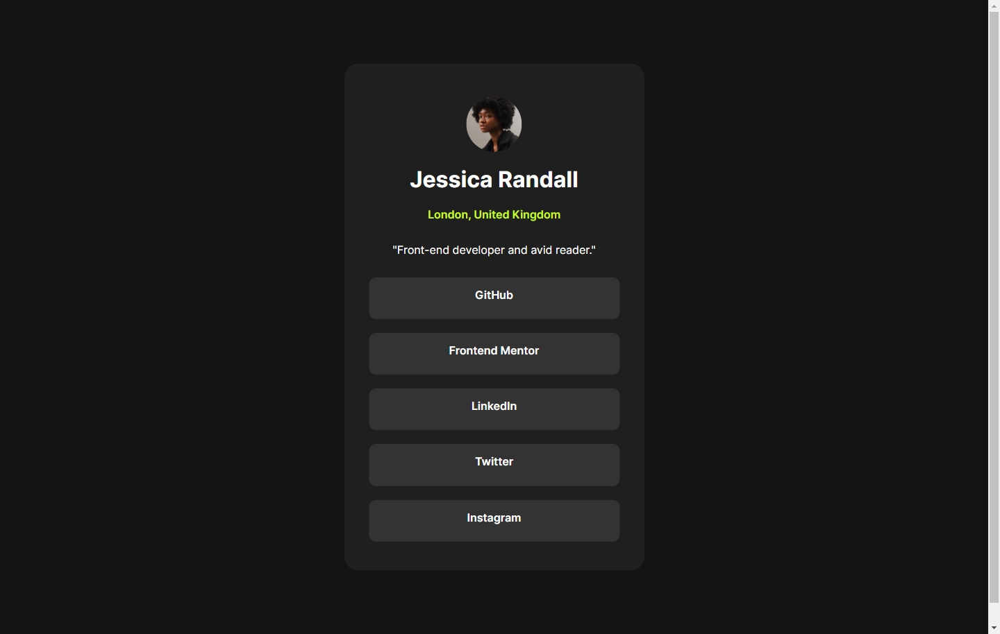
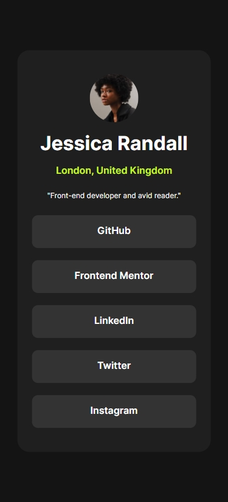

# Frontend Mentor - Social links profile

In this small project, you'll build out your social link-sharing profile. You can even personalize it and use it to share all your social profiles!

## Table of contents

- [Overview](#overview)
  - [The challenge](#the-challenge)
  - [Screenshot](#screenshot)
  - [Links](#links)
- [My process](#my-process)
  - [Built with](#built-with)
  - [Useful resources](#useful-resources)
- [Author](#author)

## Overview

### The challenge

Build social link-sharing profile.

### Screenshot

Desktop version

Mobile version

### Links

- Solution URL: [https://www.frontendmentor.io/]
- Live Site URL: [https://social-links-profile-jue0wyqnj-armandonery.vercel.app/]

## My process

### Built with

- HTML & CSS

### Useful resources

- [Resource 1](https://cssgrid-generator.netlify.app/) - Grid generator.

## Author

- Website - [Armando Nery](https://portfolio-armandonery.vercel.app/)
